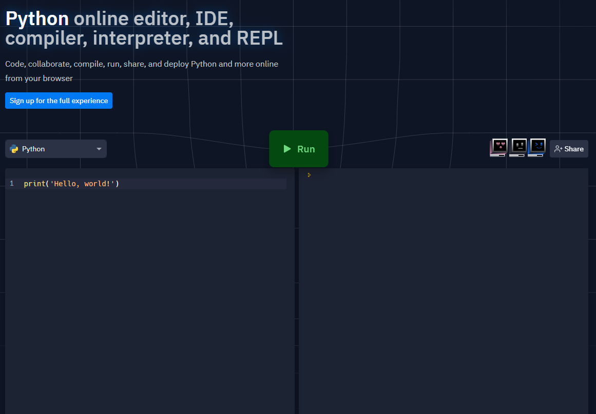

+++
title = "Where to code"
date = 2022-12-11T17:25:53+01:00
weight = 2
chapter = false
pre = "<b>2. </b>"
+++

Usually, to code, you need a software to convert the language into assembly for the machine to understand.\
However, at first, no need to install anything.\
You can just go on https://repl.it/ .

Go there.\
At the bottom of the front page, you can select the language you want to use.\
Select Python.\
You should now see the following page:


{}

{}



\
Click on the green button.\
On the right, "Hello world!" should get displayed on the right panel.

\
Try to guess what the following code does:
```py
print("It works!")
```

After that, copy and paste it on the website (replacing the previous code).
Press the green button once again.\
You should see the result.

\
Before continuing, we will see how errors work.\
Copy and paste the following:
```py
print("It doesn't work)
```

Press the green button.\
A red message should appear.\
This is an error message.\
You WILL get a lot of them, but it is normal.\
Even programmers who've been coding for 30 years still have them.\
The goal of the error message is to tell you the problem, so that you can fix it.\
In this case, try to see what the problem is.

\
A specific page will be dedicated to errors.

\
You are ready to start programming.


